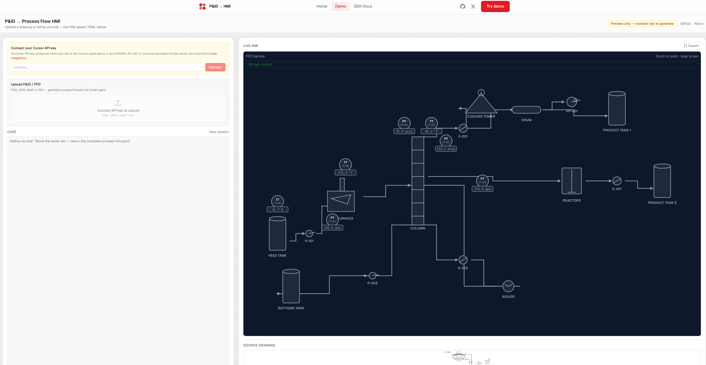

# P&ID → HMI

**Upload an engineering drawing. Get a live operator screen.**
Built with the [Cursor SDK](https://cursor.com/docs/sdk/typescript) — vision extraction, streaming agents, and structured output in a single Next.js app.

🎥 **[Video demo](https://x.com/jerrodtuck/status/2058298776503095532?s=20)** &nbsp;·&nbsp; 🌐 **[Live demo](https://cursor-sdk.com/demo)** &nbsp;·&nbsp; 📄 **[Product spec](docs/PRD.md)**



---

## Wait — what's a P&ID? What's an HMI?

If you don't work in industrial software, the title means nothing. Here's the 30-second version of why this demo exists:

**A P&ID** (Piping & Instrumentation Diagram) is the engineering drawing that defines an industrial process — every tank, pump, valve, sensor, and pipe. Every refinery, power plant, water treatment facility, and chemical plant on earth runs on these drawings. They're typically PDFs or scanned images, hand-drafted by engineers, often decades old.

**An HMI** (Human-Machine Interface) is the live operator screen that humans actually look at to run the plant. It shows the same equipment as the P&ID, but with real-time values — pressures, temperatures, flow rates, alarm states — flowing through it.

**Today, getting from one to the other takes weeks.** A SCADA engineer opens an HMI builder (Ignition, FactoryTalk, Wonderware), manually drags every pump, tank, and valve onto a canvas, wires up every tag by hand, configures every alarm, and exports a static screen. Then the P&ID gets revised, and they do it again. Multiply this across thousands of facilities worldwide.

**This demo collapses that workflow into seconds.** You upload the drawing. A vision model reads the equipment, piping, and instrument tags. It returns structured YAML. The browser renders a live, interactive SVG operator screen with simulated values. Refinements happen by chat ("move the boiler left," "add a hi-hi alarm on PT-301 at 150 psig") or by editing the YAML directly.

For anyone in industrial SCADA, this is a workflow that's been begging to be automated for 20 years. The Cursor SDK is the first tool I've used where the vision + structured output + streaming primitives line up cleanly enough to actually build it.

---

## What this demonstrates

For developers evaluating the Cursor SDK, here's what the codebase shows end-to-end:

- **Vision extraction** — Upload PNG, JPEG, or PDF. Agent reads the drawing and returns `process-hmi.yaml` describing equipment topology, instrument tags, and alarm limits.
- **Local Cursor SDK** — `Agent.create` and `Agent.resume` for multi-turn refinement, with SSE streaming to the browser.
- **Structured output** — YAML validated with Zod before rendering. Invalid output is caught and surfaced inline.
- **Live SVG canvas** — ISA-style instrument bubbles, alarm colors, mock tag values. No drag-and-drop designer.
- **Secure BYOK** — HttpOnly cookie for the hosted demo, `.env.local` for local development.

Each demo capability maps to a specific SDK concept:

| Demo capability | SDK concept |
|---|---|
| Diagram upload (PNG/PDF) | Vision + `Agent.send` with `images[]` |
| Chat refinements | `Agent.create` + multi-turn `Agent.resume` |
| Streaming responses | `run.stream()` over Server-Sent Events |
| YAML output | Structured extraction + Zod validation |
| SVG canvas preview | Render validated config with live mock tags |
| HttpOnly API key | Secure BYOK for hosted demos |

---

## Try it

**Hosted demo:** [cursor-sdk.com/demo](https://cursor-sdk.com/demo)
A bundled PFD sample renders immediately on load with simulated live values — no API key required. To generate from your own uploads, [connect a Cursor API key](https://cursor.com/dashboard/integrations) on the demo page (stored as an HttpOnly cookie, never logged).

**Run locally:**

```bash
git clone https://github.com/jerrodtuck/cursor-sdk-web.git
cd cursor-sdk-web
npm install
cp .env.local.example .env.local
# Optional: add CURSOR_API_KEY to .env.local for local generation
npm run dev
```

Open <http://localhost:3000/demo>.

**Prerequisites:** Node.js 20+, optionally a [Cursor API key](https://cursor.com/dashboard/integrations).

---

## Demo walkthrough

1. Open `/demo` — the bundled PFD sample renders as an SVG operator screen with live mock tag values
2. Compare the source PNG alongside the generated canvas
3. Upload `docs/examples/pid_example.png` (or your own P&ID/PFD) → click Generate HMI
4. Refine via chat: *"Add a hi-hi alarm on PT-301 at 150 psig"*
5. Edit YAML directly — validation errors surface inline

---

## Architecture

```
┌──────────────────────────────────────────────────────────────┐
│                         Browser                              │
│  ┌────────────┐  ┌──────────────┐  ┌──────────────────────┐  │
│  │  Upload    │  │  Chat panel  │  │  SVG HMI canvas      │  │
│  │  P&ID/PFD  │  │  refinement  │  │  + live mock tags    │  │
│  └─────┬──────┘  └──────┬───────┘  └──────────▲───────────┘  │
└────────┼────────────────┼─────────────────────┼──────────────┘
         │                │                     │
         │  multipart     │  SSE stream         │  validated YAML
         ▼                ▼                     │
┌──────────────────────────────────────────────────────────────┐
│              Next.js Route Handlers                          │
│  POST /api/agent          POST /api/connect                  │
│  └─ Cursor SDK            └─ HttpOnly cookie BYOK            │
└──────────────────────┬───────────────────────────────────────┘
                       │
                       ▼
┌──────────────────────────────────────────────────────────────┐
│                    Cursor SDK                                │
│   Agent.create → Agent.send (image) → run.stream() → wait()  │
└──────────────────────┬───────────────────────────────────────┘
                       │
                       ▼
              process-hmi.yaml (Zod-validated)
                       │
                       ▼
               SVG render + mock tag simulation
```

---

## Project layout

```
app/demo/             Interactive designer page
app/api/agent/        POST /api/agent — Cursor SDK + SSE + vision
app/api/connect/      POST /api/connect — HttpOnly API key BYOK
components/process/   SVG canvas, ISA symbols, upload component
lib/process/          process-hmi DSL schema, layout engine, mock tags
fixtures/             pfd-sample.yaml (offline preview)
docs/examples/        pid_example.png, ISA symbol reference, Kimray PDF
docs/PRD.md           Full product spec
types/                Shared TypeScript types
```

---

## API reference

### `POST /api/agent`

```json
{
  "prompt": "Convert this P&ID into process-hmi.yaml",
  "agentId": "optional — resume an existing agent",
  "currentYaml": "optional — current YAML for refinement turns",
  "image": { "data": "base64...", "mimeType": "image/png" }
}
```

Returns Server-Sent Events streaming the agent's output.

### `POST /api/connect`

Validates a Cursor API key and stores it in an HttpOnly cookie scoped to the demo origin.

---

## Core SDK pattern

The integration pattern used in `app/api/agent/route.ts`:

```ts
await using agent = await Agent.create({
  apiKey: process.env.CURSOR_API_KEY!,
  model: { id: "composer-2.5" },
  local: { cwd: process.cwd(), settingSources: [] },
});

const run = await agent.send(prompt);

for await (const event of run.stream()) {
  // Stream events to the client via SSE
}

await run.wait();
```

See the [TypeScript SDK reference](https://cursor.com/docs/sdk/typescript) for full API details.

---

## Scripts

```bash
npm run dev      # Next.js dev server
npm run build    # Production build
npm run lint     # ESLint
```

---

## Built by

[Jerrod Tuck](https://jerrodtuck.com) — SCADA engineer and full-stack developer. Founder of [narya](https://naryacommand.com), building AI-native software for industrial operators.

[GitHub](https://github.com/jerrodtuck) · [X / @jerrodtuck](https://x.com/jerrodtuck) · [jerrodtuck.com](https://jerrodtuck.com)