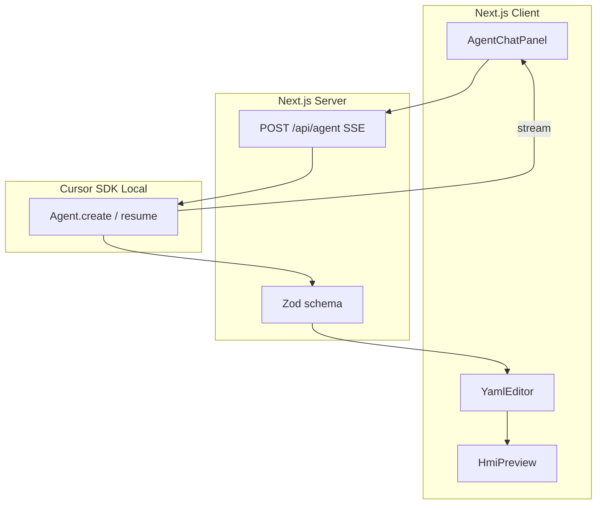
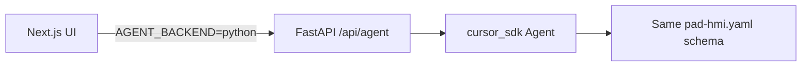

# Pad HMI Designer — Product Requirements Document

## Problem & Vision

Industrial operators rely on HMIs (Human Machine Interfaces) to monitor oil and gas production pads — separators, wellheads, tanks, pumps, and associated instrumentation. Designing these screens traditionally requires specialized SCADA tools and manual tag mapping from P&ID (Piping and Instrumentation Diagram) documentation.

**Pad HMI Designer** demonstrates the Cursor SDK by co-designing operator screens through natural language. An agent generates and revises a text-based HMI configuration (YAML DSL) inspired by P&ID tag naming conventions (PT, LT, FT, etc.). Users edit the YAML directly and see a live operator-style preview with simulated tag values and alarm states.

This project serves as a reference integration for `@cursor/sdk` (TypeScript) with a planned Phase 2 FastAPI backend using `cursor_sdk` (Python).

---

## Goals

| Goal | Description |
|------|-------------|
| Streaming agent chat | Multi-turn design via `Agent.create` / `Agent.resume` with SSE streaming |
| Editable YAML DSL | Human-readable config the agent and user can both modify |
| Live HMI preview | Operator-style widgets driven by validated config |
| Mock tag simulation | Drifting values and alarm evaluation without real SCADA |
| Local Cursor SDK | Explicit `local: { cwd }` runtime for development demos |

## Non-Goals (v1)

- Full P&ID CAD or ISO 10628 symbol library
- Real SCADA / OPC / Modbus tag binding
- Cloud agent runtime
- Drag-and-drop HMI builder
- User authentication or multi-tenant sessions
- Persisting designs to a database
- FastAPI / Python SDK implementation (Phase 2)

---

## Personas

1. **SDK Evaluator** — Wants to see how `@cursor/sdk` integrates into a web app with streaming and multi-turn conversation.
2. **Controls Engineer** — Familiar with pad equipment and ISA tag naming; wants structured output they can inspect and edit.
3. **Demo Presenter** — Needs a reliable scripted flow that works offline from fixture data and online with an API key.

---

## User Stories (v1)

| ID | Story | Acceptance |
|----|-------|------------|
| US-1 | As a user, I describe a pad in chat and receive an initial HMI config | Agent returns valid YAML in a fenced block; preview renders |
| US-2 | As a user, I edit YAML manually and see the preview update | Parse errors shown inline; valid edits reflect immediately |
| US-3 | As a user, I send follow-up prompts to refine the design | `Agent.resume` preserves context; incremental edits applied |
| US-4 | As a user, I view alarm states on widgets | Simulated tag values trigger hi/hiHi styling |
| US-5 | As a user, I load the demo without an API key | Fixture pad renders with mock tags (chat disabled or shows key hint) |

---

## HMI DSL Specification (v1)

Configuration files use YAML. Schema is enforced via Zod (`lib/hmi/schema.ts`).

### Top-level structure

```yaml
site: "Eagle Ford Pad 7"
equipment:
  - id: SEP-101
    type: separator
    tags: [PT-101, LT-101, FT-101]
screens:
  - id: overview
    title: Pad Overview
    layout: grid
    columns: 3
    widgets:
      - tag: PT-101
        type: gauge
        label: Sep Pressure
        unit: psig
        alarms: { hi: 150, hiHi: 175 }
```

### Equipment types

| Type | Description |
|------|-------------|
| `wellhead` | Wellhead assembly |
| `separator` | Production separator |
| `tank` | Storage / surge tank |
| `pump` | Transfer or injection pump |
| `compressor` | Gas compression |
| `flare` | Flare stack |

### Widget types

| Type | Description |
|------|-------------|
| `gauge` | Numeric gauge with optional hi/hiHi alarms |
| `level_bar` | Vertical level indicator (0–100%) |
| `status_badge` | On/off or enum status display |
| `alarm_banner` | Active alarm summary strip |

### Tag naming convention

ISA-style instrument tags: `{TYPE}-{LOOP}`

- `PT` — pressure transmitter
- `LT` — level transmitter
- `FT` — flow transmitter
- `TT` — temperature transmitter
- `XV` — shutdown valve

### Alarm object (optional on gauge / level_bar)

```yaml
alarms:
  lo: 10
  loLo: 5
  hi: 150
  hiHi: 175
```

---

## Agent Behavior Contract

The system prompt (`lib/agent/system-prompt.ts`) instructs the agent to:

1. Output **only** valid pad HMI YAML inside a single fenced ` ```yaml ` block.
2. Preserve existing equipment IDs and tags when making incremental changes.
3. Use consistent ISA-style tag names tied to equipment IDs.
4. Include at least one screen with widgets referencing defined tags.
5. When revising, return the **complete** updated YAML document, not a diff.

---

## Technical Architecture

### v1 — Next.js + TypeScript SDK



| Concern | Approach |
|---------|----------|
| Framework | Next.js 15 App Router, TypeScript, Tailwind CSS |
| SDK | `@cursor/sdk` with `local: { cwd, settingSources: [] }` |
| Auth | `CURSOR_API_KEY` in `.env.local` (server-only) |
| Agent lifecycle | First turn returns `agentId`; client sends on follow-ups for `Agent.resume` |
| Streaming | Server-Sent Events from Route Handler |
| Errors | `CursorAgentError` (startup) vs `result.status === "error"` (run failed) |

### Phase 2 — FastAPI + Python SDK (planned)



| Item | Plan |
|------|------|
| Endpoints | `POST /api/agent` (prompt, optional agent_id), SSE stream |
| SDK pattern | `with Agent.create(...) as agent:` + `run.messages()` + `run.wait()` |
| Schema | Same Zod-equivalent validation (Pydantic mirror of DSL) |
| Deployment | Sidecar or separate service; UI selects backend via `AGENT_BACKEND=ts\|python` |
| System prompt | Shared verbatim with TypeScript route |

Proposed layout:

```
backend/
├── main.py
├── routes/agent.py
├── requirements.txt
└── Dockerfile
```

### Phase 3 — Future

- Cloud agent runtime option
- Export to JSON / SCADA stub format
- Multi-screen navigation in preview
- Monaco editor (Phase 1.5)

---

## Success Metrics

| Metric | Target |
|--------|--------|
| Time to first preview (with fixture) | < 2 seconds |
| Time to first agent-generated preview | < 60 seconds |
| Valid YAML on first generation | ≥ 80% of demo runs |
| Follow-up edits preserve structure | No full rewrite unless requested |

---

## Demo Script

1. **Load page** — Eagle Ford Pad 7 fixture renders with simulated tags ticking.
2. **Prompt:** *"Add a hi-hi alarm at 175 psig on SEP-101 pressure and a level bar for LT-101"*
3. **Observe** — Agent streams response; YAML auto-applied; preview updates with alarm colors.
4. **Follow-up:** *"Split into Overview and Separator Detail screens"*
5. **Manual edit** — Change an alarm threshold in YAML; preview updates; introduce invalid YAML to show validation error.

---

## Roadmap

| Phase | Scope | Status |
|-------|-------|--------|
| 1 | Next.js + `@cursor/sdk`, DSL, preview, fixture | **Current** |
| 1.5 | Monaco editor, screen tabs in preview | Planned |
| 2 | FastAPI + `cursor_sdk`, backend switch env | Planned |
| 3 | Cloud agents, export formats, persistence | Future |

---

## Open Questions

- Should v1 block chat UI when `CURSOR_API_KEY` is missing, or show a graceful banner?
- Phase 2: monorepo `backend/` vs separate repository?
- Export target for Phase 3: generic JSON, Ignition, or OSIsoft PI stub?
